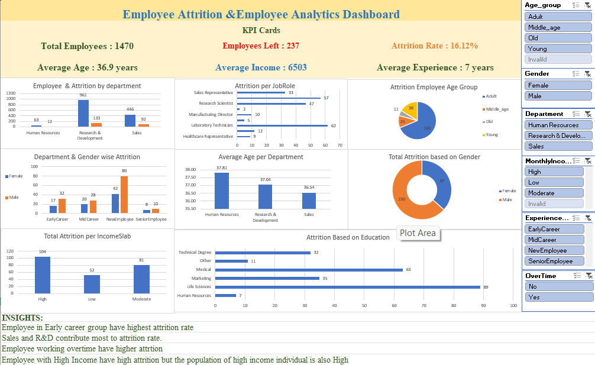
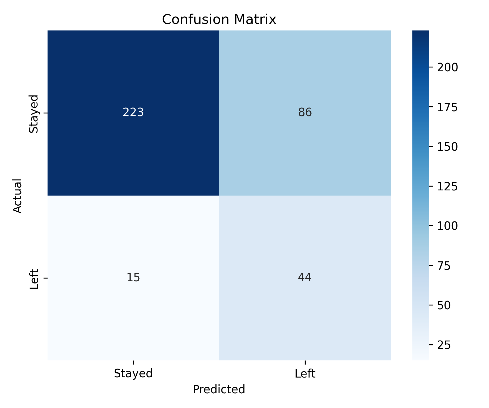
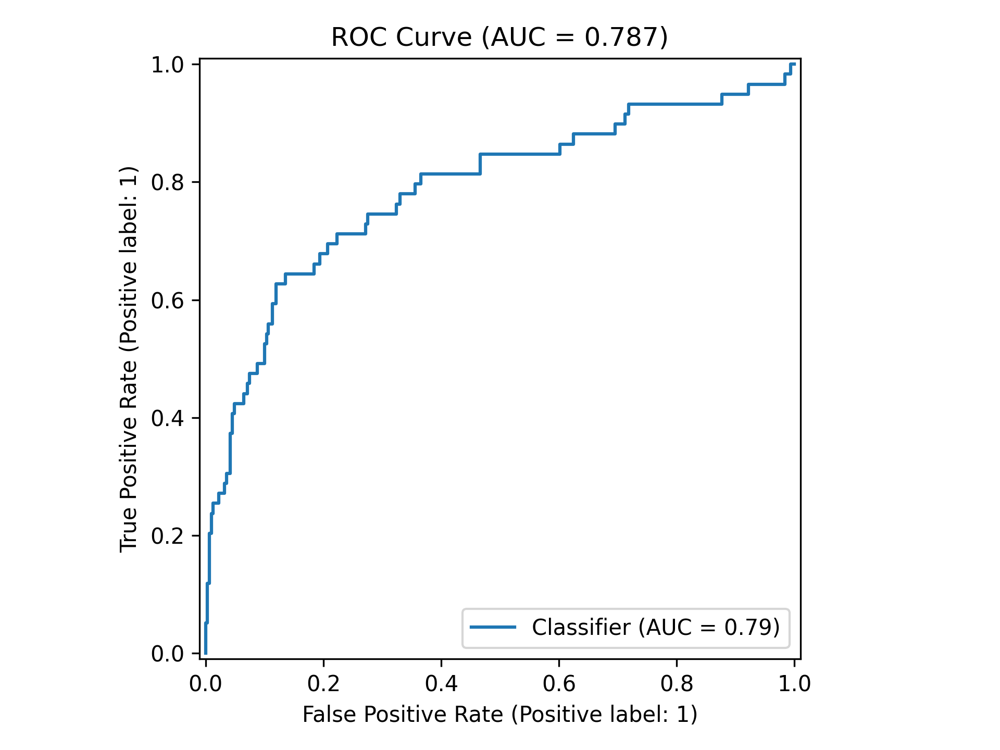
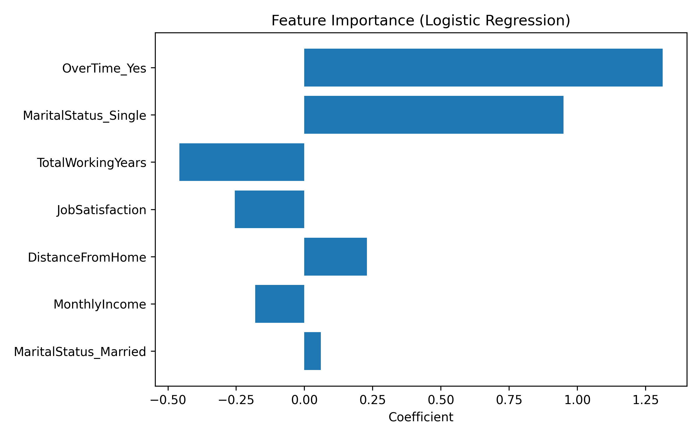
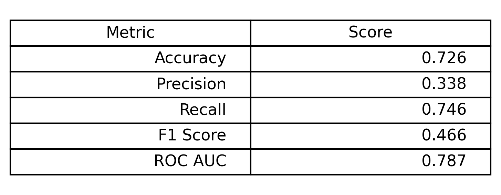

# 👨‍💼 IBM HR Employee Analytics


# IBM HR Employee Analytics

## 📌 Project Overview

This project analyzes employee data from the **IBM HR Analytics Employee Attrition & Performance** dataset. The goal is to understand employee attrition, workforce distribution, salary patterns, and department performance using **Excel** and **PostgreSQL**.

The project includes data cleaning, feature engineering, an interactive Excel dashboard, and SQL analysis to answer HR business questions.

---

## 🎯 Objectives

* Clean and prepare HR data for analysis.
* Build an interactive dashboard in Excel.
* Analyze employee attrition using SQL.
* Find patterns in employee demographics, salary, and experience.
* Answer HR business questions using data.

---

## 📊 Dataset Information

* **Dataset:** IBM HR Analytics Employee Attrition & Performance
* **Source:** Kaggle
* **Rows:** 1,470
* **Columns:** 35

### Feature Engineering

The following columns were created during data preparation:

* Age Group
* Monthly Income Slab
* Experience Group
* Salary Hike Slab
* Attrition Fixed (0 = No, 1 = Yes)

These new columns were used for dashboard filters, KPI calculations, and SQL analysis.

---

## 🛠️ Tools Used

* Microsoft Excel
* PostgreSQL
* SQL

---

## 📂 Project Workflow

1. Data Understanding
2. Data Cleaning
3. Feature Engineering
4. Interactive Dashboard Creation
5. SQL Business Analysis
6. Business Insights

---

## 🧹 Data Cleaning

The following data preparation steps were performed:

* Checked for duplicate records (no duplicates found).
* Verified data types.
* Created Age Group for employee segmentation.
* Created Monthly Income Slab.
* Created Experience Group.
* Created Salary Hike Slab.
* Converted Attrition into a numeric field (Attrition Fixed) for calculations.

---

## 📈 Dashboard KPIs

The dashboard includes the following KPIs:

* Total Employees
* Employees Left
* Attrition Rate
* Average Age
* Average Monthly Income
* Average Experience

Interactive slicers allow users to filter data by:

* Age Group
* Gender
* Department
* Monthly Income Slab
* Experience Group
* Overtime

---

## 📊 Dashboard Visualizations

The dashboard contains:

* Employee & Attrition by Department
* Attrition by Job Role
* Attrition by Age Group
* Attrition by Gender
* Average Age by Department
* Attrition by Education Background
* Attrition by Income Slab
* Department & Gender-wise Attrition

---

## 💻 SQL Analysis

SQL was used to answer HR business questions and analyze employee data.

The project includes **38 SQL business queries** covering:

### Employee Overview

* Total Employees
* Average Age
* Average Income
* Employee Distribution
* Gender Distribution
* Department-wise Employees

### Attrition Analysis

* Overall Attrition Rate
* Attrition by Department
* Attrition by Job Role
* Attrition by Overtime
* Attrition by Income Group

### Employee Demographics

* Age Groups
* Education Background
* Marital Status
* Experience Groups

### Salary Analysis

* Average Salary by Department
* Average Salary by Job Role
* Highest Paid Employees
* Lowest Paid Employees
* Department Salary Ranking

### Advanced SQL Concepts Used

* GROUP BY
* HAVING
* CASE
* Common Table Expressions (CTEs)
* Window Functions
* RANK()
* DENSE_RANK()
* LAG()
* LEAD()
* NTILE()

---

## 📷 Dashboard Preview

### Main Dashboard



### Sample Visualizations

* Department-wise Attrition
* Job Role Attrition
* Education-wise Attrition
* Income Slab Analysis
* Department & Gender-wise Attrition

---

## 💡 Key Insights

Some important findings from the analysis include:

* The overall employee attrition rate is **16.12%**.
* Sales and Research & Development departments contribute the highest number of employee exits.
* Early-career employees have higher attrition than other experience groups.
* Employees working overtime show higher attrition.
* Employee income varies across departments and job roles.
* Average employee age is different across departments.
* Education background also influences attrition patterns.

---

## 📁 Repository Structure

```text
IBM-HR-Employee-Analytics/
│
├── data/
|  
├── excel/
├── sql/
├── python/
│   └── hr_log_reg_model.py
|   └──HR_employee_ibm_dataset.csv
│
├── images/
│   ├── 01_Dashboard_OVerview.png
|   ├── 02_department_attrition.png
|   ├── 03_jobrole_attrition.png
|   ├── 04_education_attirtion.png
|   ├── 05_income_attrition.png
│   ├── confusion_matrix.png
│   ├── roc_curve.png
│   ├── feature_importance.png
│   └── model_metrics.png
│
├── README.md
└── requirements.txt
```

---
## 🤖 Employee Attrition Prediction

### Model Performance









## 🚀 Future Improvements

Some improvements that can be added in the future:

* Build the dashboard in Power BI.
* Add employee performance metrics.
* Automate reporting using Python.
* Compare HR data across multiple companies.

---

## 👨‍💻 Author

**Aditya Mishra**

If you found this project helpful, feel free to explore the repository or connect with me on GitHub and gmail.
gmail: aadityamishra0107@gmail.com
